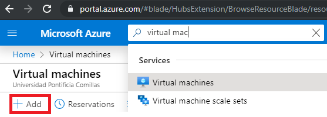
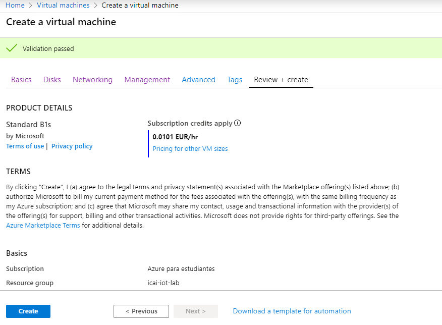

# Creating a device VM
In this module we will create a virtual machine, simulating a device that connects to Azure IoT Hub

## In the search window, look for "Virtual Machines" and press "New"

## Parameterize virtual machine basics
- Use the previously created resource group
- Name the VM
- Select Region "West Europe"
- Put your user and password. Optionally, if you are familiar with public/private keys, input your public key
- Select the VM size B1s, the one included in the free tier. Press "Change Size" and select "B1s"

## Remove network security rules
In order to facilitate Azure IoT hub communications, we are going to disable Network Security Groups. For this, in the Networking tab, select "Nic network security group" to "None", as shown in the following image

## Validate the VM creation
Once the VM configuration is OK, the following green mark will show up, so the VM creation can be triggered. Click "Create" if you see "Validation passed". It not, verify any missing parameters"

## VM is already created
After a few minutes, the VM should be running, as shown in the following snapshot

## Get the SSH connection string
In the previous snapshot, click "Go to resource". Select "Connect" in the following menu. A lateral blade with the connection details will show up, as shown below

## Connect to the VM via SSH
When connecting to the VM, accept the VM public key by inputing "yes", as shown below

Once connected, a command promt like the following will show up:

## Install required packages and repos
Execute the following commands. Try to make sense at what those commands do
'''
sudo apt-get update -y
sudo apt install python-pip -y
pip install azure-iot-device
git clone https://github.com/SeryioGonzalez/azure-iot.git
'''
