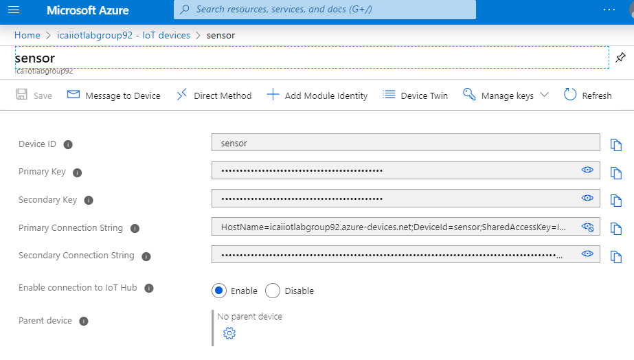
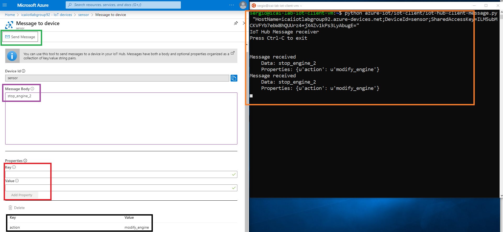

# Sending messages to the device 

One of the key aspects of IoT architectures is the capability of managing and signaling devices from a central platform.
In this lab we will send a manual message to a device and we will show an example piece of code that can react to downstream cloud to device messages. Extending this capability for more complex in-device behaviours would be the logical next step

### Run a python script for message reception

In order to get to the Azure Portal facility for sending a message to a device, navigate to the device menu, as shown in the following image and click in the **Message to Device** window in the device menu of Azure IoT Hub.



A new script has been added to the repo to be loaded in the simulated device.
As shown, below, we have run the following script in the simulated device:

```
*your_user*@icai-lab-iot-client-vm:~$ python azure-iot/iot-client/iot-hub-client-message.py "**your_device_connection_string**"
```
We have composed the message shown below, where we have set the message body to a plain string **stop_engine_2**, as shown in purple. Additionally, we have added a custom property **action** equals **modify_engine**.
Click in **Send Message** as shown in green. The message should be pointed out in the client connection window as highlighted in orange.


