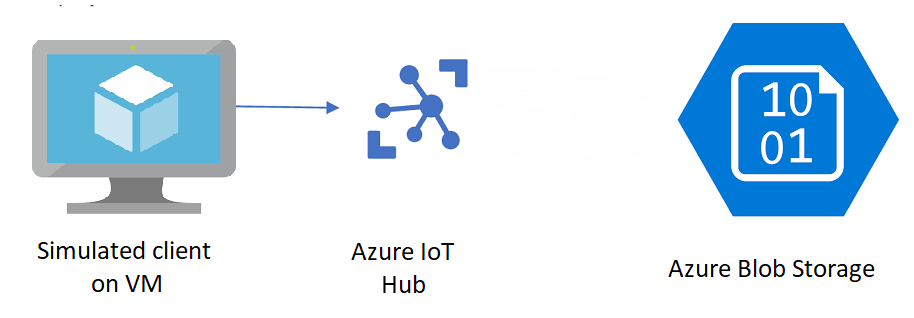
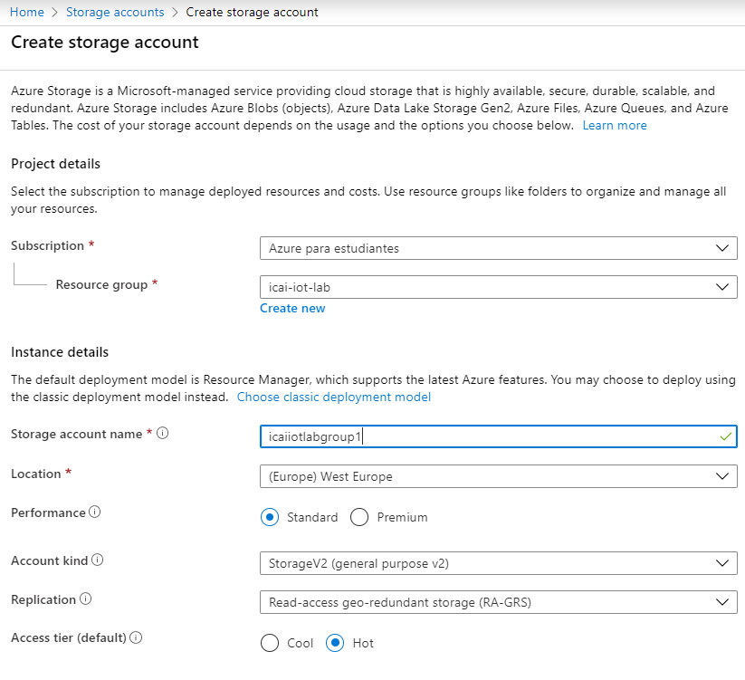
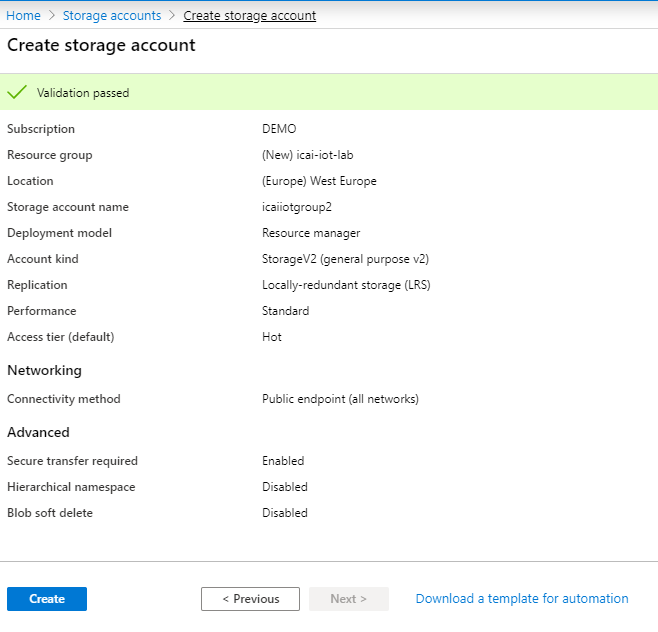

# Creating an Azure Blob Storage
In previous modules, we have set-up a simulated client sending traffic to an [Azure IoT Hub](https://docs.microsoft.com/en-us/azure/iot-hub/)  instance. At this point, Azure IoT Hub is not doing anything with that data, which obviously is not very useful.
Azure IoT Hub, apart from supporting device security and management, is a message broker capable of sending those IoT device messages to other services for consuming them.
In this module, we will create an [Azure Blob Storage](https://docs.microsoft.com/en-us/azure/storage/blobs/storage-blobs-overview). In the next module, we will configure Azure IoT Hub for storing device messages in the storage created in this module.
The outcome of this module, added to what has been done in the previous 2 modules is summarized in the following image

Blob storage is a highly scalable cloud storage service, allowing massive data ingest at very low price 

## Create an Storage Account in the Azure portal

Look for **Storage Account** in the Azure Portal. Click "Add" in order to create your Storage Account. Use the resource group previously used and name the storage account **icaiiotgroupX**, where X is your group ID. Select **LRS** as Replication option. 

Once you click **Review + create**, a window similar to the one that follows will show up.
If the Validated message in green is displayed, press **Create**

## Create an Storage Container in the Storage Account

We are going to use blobs for storing sensor data. Blobs are stored in Containers. For this, we need to create a container. 
Select **Containers** as highlighted in red in the image below and click **+ Container** as shown in purple. Name the container **sensordata** as shown in blue. Set access level to Container (see in orange).

*For simplicity for this lab, considering we are not storing personal data, we can put access policy to anonymous.* *Never use anonymous access to a container hosting* **personal data** 

After clicking OK, this module is done. Go to the next module for continuing the lab and store sensor data in blobs in this storage account.
[Go back to the main section](../README.md )
